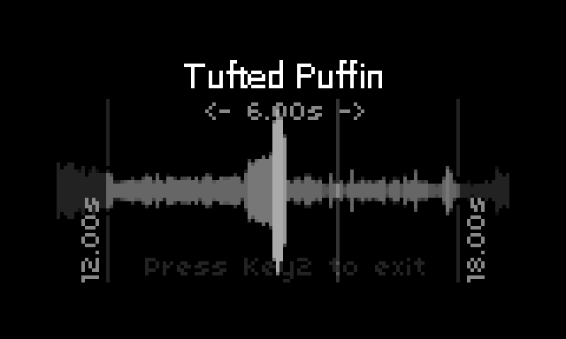

# Taweeet

### A Norns script for exploring bird sound
Taweeet allows one to display images of various birds and play with corresponding audio clips. 
There are about 1,000 birds configured, and each has 10 pictures available and up to 10 audio clips. 
So it is a lot to explore!

### Current state of Taweeet
It works! But only part of the full feature set has been implemented. Currently you can select a species, 
picture, and audio track, 
or you can request random ones. The audio tracks are up to 30 seconds long. The audio track is played back in a loop, 
and the begin and end points of the loop can be adjusted via the [Audio Clipping](#audio_clipping) screen. And you can of 
course add in the usual Norns effects like reverb.

### What is a Norns??
A Norns is an open source synthesizer based on a Raspberry Pi. Its really interesting because 
it is both capable and it has a big and active community. It is also because it has quite a 
crummy screen, 128x64 with just 16 levels of greyscale. But that is a feature! Having a very 
limited screen means one has to be more creative and adventuresome when creating a user interface.

To learn more see the [Norns documentation](https://monome.org/docs/norns/)

### Audio Clipping Screen
You enter the audio clipping screen by twisting encoder 2 or 3. The audio clip screen displays 
the amplitude of the currently selected 
portion of the audio cilp. 

### Taweeet backend
Since Taweeet handles so many bird types (about 1,000) there is no way to really combine all the data
into a Lua script. Therefore I create a backend that gathers all the list of birds, along with photos 
and sound clips, and converts the photos and sound clips to formats that work with a Norns. 

But you don't need worry about the backend since I run a server which is always available (uses a
Raspberry Pi justs like the Norns does). 

The backend is written in Python and [can be found on Github](https://github.com/skibu/imager). 

### The nornsLib library
When developing Taweeet I ran into lots of complications and places where I thought the user interface 
could be improved. I figure it would help to demonstrate my suggestions before trying to submit pull
requests. Plus the library addresses the bugs I ran into. Others can easily use the nornsLib library
for their script and not wait for any of the features to be part of a regular Norns software release.
Plus the library addresses some thorny problems, like how to create a really nuce audio clipping 
user interface, and I wanted others to be able to take advantage of my work.

See the [nornsLib github repo](https://github.com/skibu/nornsLib) for details.

### Who am I
My name is Skibu, aka SynthBu, aka Michael Smith. I have a big technical background and have spent 
50 years programming.  Started with doing research in robotics, but then switched to doing data work 
for public transportation. I've also been really into music my whole life, especially with respect to 
playing piano.

Two years ago I got long COVID and can no longer work nor do many other things due to extreme fatigue 
and cognitive dysfunction. I highly recommend against it. Since I can't play the piano in the same way 
(I'm limited to about 30 minutes a day now) I thought I would also explore synths since they are
not as real time. Then a couple of months ago I found out about Norns and I purchased one, and I decided 
to try doing some programming. Turns out it is really hard for me compared to before, but still
fun to learn about Norns programming. Its just that everything now takes 10 times as long.

You can also see [my YouTube channel](https://www.youtube.com/@SynthBu) for more fun. 
